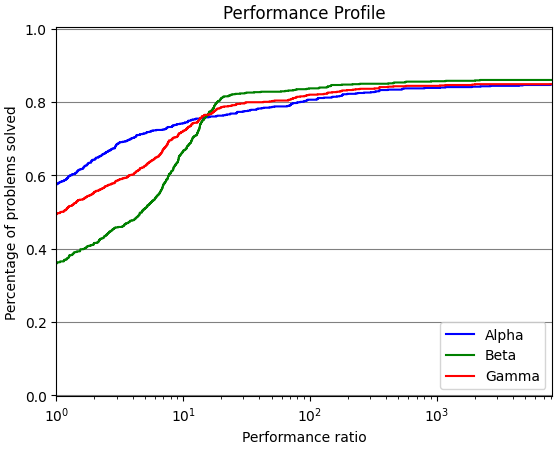

# Welcome to perprof-py's documentation

**perprof-py** is a free/open source Python module for performance profiling
(as described by [Dolan and Moré](http://arxiv.org/abs/cs/0102001)), such as the one below:

For more details, you can check our reference:

> Siqueira, A. S., Costa da Silva, R. G. and Santos, L.-R., (2016). Perprof-py: A Python Package for Performance Profile of Mathematical Optimization Software. Journal of Open Research Software. 4(1), p.e12. DOI: [10.5334/jors.81](http://doi.org/10.5334/jors.81).

Please **cite us** using the reference above if you use our software.
